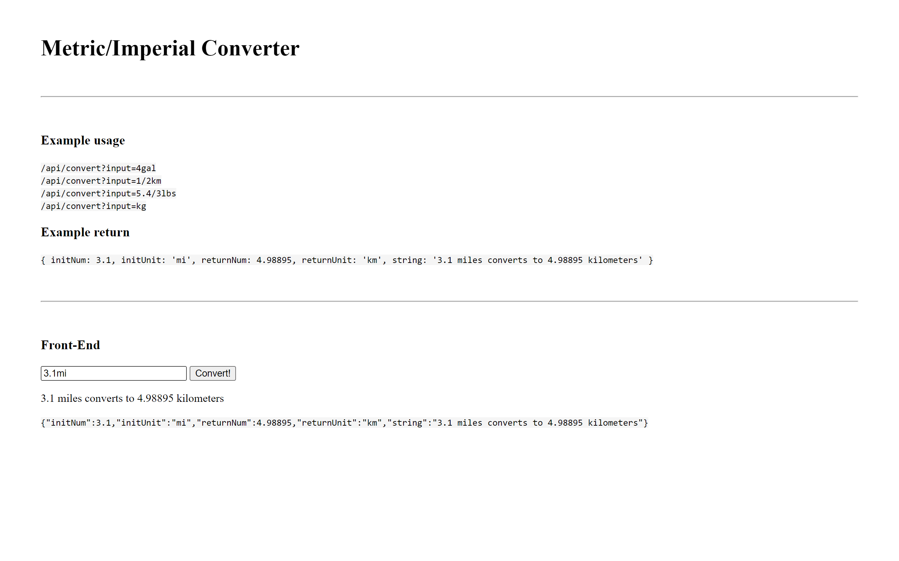

# [freeCodeCamp Quality Assurance certification](https://www.freecodecamp.org/learn/quality-assurance/)

## [Metric-Imperial Converter](https://www.freecodecamp.org/learn/quality-assurance/quality-assurance-projects/metric-imperial-converter)

Working example: https://url--shortener--project.herokuapp.com/

My git repo: https://github.com/Raff1010X/01.Roadmap

